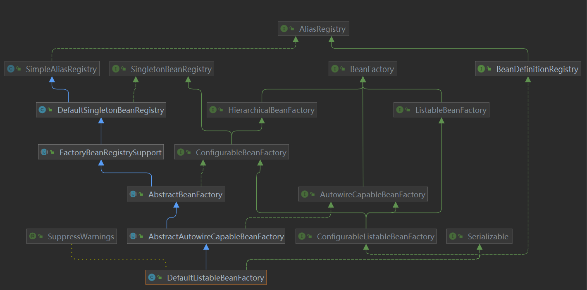
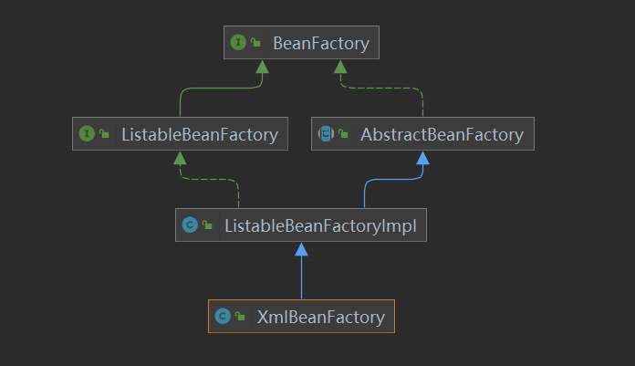
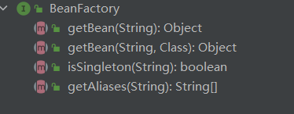
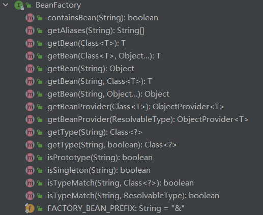

# 概述

项目的初衷是独立作出一个成熟的有特色的IOC容器,但由于过程参考Spring太多,而且也无法作出太多改进,于是目的变为以此项目作为理解Spring的一个跳板,与网上的一些模仿Spring的框架不同,本项目主要是针对注解形式

# 流程

在Spring中,一个bean的形成分三个大的阶段,

1. bean的定义阶段(包含BeanDefinition的加载,解析,与注册)
2. bean的实例化阶段(包含对象的创建,属性的注入)
3. bean的初始化阶段(包含一些资源的初始化,譬如打开文件建立连接等等)

这只是大概的划分,关于BeanPostProcessor等后置处理并没有显式的提及.

# 类的设计

如果只想了解一个bean是怎么从生到死的,只需要一步步debug就好了,如果看不懂,就多debug几遍.可是如果想实现一个类似的容器,类的设计,职责的分配,接口的实现继承必然是要了解的(除非你想几个类做完所有的事)

以下是`DefaultListableBeanFactory`的类图



是不是顶不住

我们再来看一张图



第一张是`Spring5.0`的,第二张图是`Spring0.9`的,所以并没有必要在一开始就引入过多的设计复杂度

我们再来看一套对比图





哪一个是0.9的,哪一个是5.0的一目了然.

说这么多的目的,是说明我们没必要一开始就奔着最完善的目标去写,可以一步步来,一步步加入功能

# 实现简易IOC

众所周知,SpringIoC中最基本的就是`BeanFactory`

我们先定义一个BeanFactory接口

```java
//暂时就给这一个方法
public interface BeanFactory {
    /**
     * 根据名字获取Bean实例
     * @param name
     * @return
     */
    Object getBean(String name);
}
```


## beanDefinition

> 由于是注解形式,我们不能再像xml那样给定一个资源文件再去解析了,而应该去扫描classPath下所有带有`@Component`的类,
>
> 这时候我们需要给定的参数就从文件路径变成了包路径,我们只需要扫描这个包及其子包内符合条件的类,并且将其转化为BeanDefinition再注册就好.执行这个功能的是`ClassPathBeanDefinitionScanner`这个类.在这一步,就已经和传统的流程有所区别了,我们会传入一个ResourceLoader去实现具体的扫描功能(即定位),但不会再有专门的类去处理解析这一步

```java
public interface Resource {
    File getFile();
    String getFilename();
    String getFilePath();
}
//在最初设计的时候这个抽象类似乎没有用,但考虑到以后的扩展,还是先放在这
public abstract class AbstractResource implements Resource {

    @Override
    public String getFilename() {
        return getFile().getName();
    }

    @Override
    public String getFilePath() {
        return getFile().getPath();
    }
}
//这就是最终我们实例化bean时用到的Resource类,在Spring中并没有直接用,而是通过外观模式集成了一下成为RootBeanDefinition
public class ClassPathResource extends AbstractResource {
    private final String path;

    private ClassLoader classLoader;

    private Class<?> clazz;

    public ClassPathResource(String path, ClassLoader classLoader, Class<?> clazz) {
        this.path = path;
        this.classLoader = classLoader;
        this.clazz = clazz;
    }
}
```

```java
public interface ResourceLoader {
    Resource getResource(String location);
}
//此类能够实现加载多个资源
public interface ResourcePatternResolver extends ResourceLoader {
    String CLASSPATH_ALL_URL_PREFIX = "classpath*:";
    List<? extends Resource> getResources(String location);
}

//这个类就是正式用于扫描的类了
public class PathMatchingResourcePatternResolver implements ResourcePatternResolver {
    private final ResourceLoader resourceLoader;
    public PathMatchingResourcePatternResolver(ResourceLoader resourceLoader){
        this.resourceLoader = resourceLoader;
    }

    @Override
    public Resource getResource(String location) {
        return resourceLoader.getResource(location);
    }
//在Spring中,是通过一层层方法的包装完成包名到路径的转换再到每个文件的扫描再转换为Resource,这里暂时就先一步到位,把具体实现放在工具类里
    @Override
    public List<? extends Resource> getResources(String location) {
        Set<Class<?>> classes = ClassUtils.getClasses(location);
        List<ClassPathResource> classPathResources = new ArrayList<>();
        for (Class<?> clazz:classes) {
            classPathResources.add(new ClassPathResource("",clazz.getClassLoader(),clazz));
        }
        return classPathResources;
    }
}
```

但最后直接使用的并不是`PathMatchingResourcePatternResolver`

而是把他作为`ClassPathBeanDefinitionScanner`的一个属性,在这个类里调用.

我们得到了Resource,如何获得对应的`BeanDefinition`?

先考虑这样一个问题,什么样的类可以被注册`BeanDefinition`?

1. 添加了@Component注解或者满足其他注册的条件
2. 不是接口或者抽象类

所以我们可以单独抽象出一个方法` boolean isCandidateComponent(Class<?> clazz)`来判断是否被注册

现在到了注册阶段,依旧秉持面向接口编程的理念,同时考虑到单一职责,我们把注册Bean定义单独抽象出来

```java
public interface BeanDefinitionRegistry {
    void registerBeanDefinition(BeanDefinition beanDefinition);
}
```

上文说到Bean定义的定位,解析,注册都是在`ClassPathBeanDefinitionScanner`里完成的,于是`BeanDefinitionRegistry`自然也成为了`ClassPathBeanDefinitionScanner`的属性之一

于是`ClassPathBeanDefinitionScanner`构建完成了

```java
public class ClassPathBeanDefinitionScanner {
    //负责具体的Resource定位
    private ResourcePatternResolver resourcePatternResolver;
    //负责BeanDefinition解析
    private BeanDefinitionRegistry registry;

    public ClassPathBeanDefinitionScanner(BeanDefinitionRegistry registry,String...basePackage) {
        this.registry = registry;
        this.resourcePatternResolver = new PathMatchingResourcePatternResolver((ResourceLoader) registry);
        this.scan(basePackage);
    }

    public void scan(String...basePackages){
        doScan(basePackages);
    }
    void doScan(String[] basePackages){
        Set<BeanDefinition> beanDefinitions = new LinkedHashSet<>();
        for (String basePackage:basePackages) {
            Set<BeanDefinition> candidates = findCandidateComponents(basePackage);
            for(BeanDefinition candidate:candidates){
                beanDefinitions.add(candidate);
                registry.registerBeanDefinition(candidate);
            }
        }

    }

    //获取被注册的bean的集合
    private Set<BeanDefinition> findCandidateComponents(String basePackage) {
        Set<BeanDefinition> candidates = new LinkedHashSet<>();
        List<? extends Resource> resources = getResourcePatternResolver().getResources(basePackage);
        for(Resource resource:resources){
            if(resource instanceof ClassPathResource){
                ClassPathResource classPathResource = (ClassPathResource)resource;
                if(isCandidateComponent(classPathResource.getClazz())){
                    AnnotationBeanDefinition beanDefinition = new AnnotationBeanDefinition();
                    beanDefinition.setClazz(classPathResource.getClazz());
                    beanDefinition.setBeanName(BeanUtils.generateBeanName(classPathResource.getClazz().getName()));
                    candidates.add(beanDefinition);
                }
            }
        }
        return candidates;

    }
    private ResourcePatternResolver getResourcePatternResolver() {
        return this.resourcePatternResolver;
    }
    //判断是否被注册
    boolean isCandidateComponent(Class<?> clazz){
        Component declaredAnnotation = clazz.getDeclaredAnnotation(Component.class);
        return declaredAnnotation!=null&&!clazz.isInterface();
    }

    ;
}
```

## 实例化

在什么时候实例化?我们说,在调用getBean()而又没有现成的bean时进行实例化

```java
public abstract class AbstractBeanFactory implements BeanFactory{
    @Override
    public Object getBean(String beanName)
    
}
```


### 对象创建

有两种方式,通过Jdk默认的反射实现,或者用cglib代理实现.

默认自然是无参构造,但是如果传入了参数,则需要根据参数的类型和数量去匹配对应的构造函数,用其去实例化

于是我们抽象出`InstantiationStrategy`作为实例化接口,两种实例化方法都需要实现这个接口,我们真正去用的时候只需要去调该接口的方法就好

```java
public interface InstantiationStrategy {
    Object instantiate(BeanDefinition beanDefinition, String beanName, BeanFactory owner);
}
public class SimpleInstantiationStrategy implements InstantiationStrategy {
}
```

### 属性注入

#### 字段值获取

有两种方式可以实现字段值获取

1. 直接注解Autowired或者Value
2. Value里面填的不是值而是占位符,那么就需要解析占位符去获取

我们通过Class对象获取所有字段,再通过遍历所有字段查找加在字段上的注解来获取(这仅仅只是Spring的一种注入方式)

```java
 //处理@Autowired注解
        for(Field field:declaredFields){
            Autowired autowired = field.getDeclaredAnnotation(Autowired.class);
            if(autowired != null){
                pvs.add(new PropertyValue(field.getName(),new BeanReference(BeanUtils.generateBeanName(field.getType().getName()),field.getType())));
            }
        }
        //处理@Value注解
        for(Field field:declaredFields){
            Value value = field.getDeclaredAnnotation(Value.class);
            if(value != null){
                String value1 = value.value();
                pvs.add(new PropertyValue(field.getName(),value1));
            }
        }
```


#### 字段值填充

获取字段值后通过反射填入相应的字段中

```java
for(Field field:mbd.getBeanClass().getDeclaredFields()){
                field.setAccessible(true);
                if (field.getName().equals(propertiesValue.getName())&&field.getType().isAssignableFrom(newValue.getClass())) {
                    field.set(bean,newValue);
                }
            }
```


## 初始化

调用指定的初始化方法,进行资源的初始化.,如何获取初始化方法?在xml模式中,只要加个标签即可,如果是注解模式,加个注解标识一下或者在某个注解上加个参数,代表初始化方法,这个还没有实现

# 功能填充

## 后置处理器添加

上面我们已经实现了一个可以进行依赖查找,依赖注入的Bean容器,让我们再回顾一下Spring的流程,我们少了些什么,最容易想到的应该就是后置处理器了,包括`BeanFactoryPostProcessor`和`BeanPostProcessor`两种,前者对于`beanFactory`进行修改操作,后者对于`bean`进行修改操作,同样是面向接口编程

首先建立`BeanPostProcessor`

```java
public interface BeanPostProcessor {
   
    Object postProcessBeforeInitialization(Object bean, String beanName);

    Object postProcessAfterInitialization(Object bean, String beanName) ;
}
```

就目前来看,有什么是需要`BeanPostProcessor`来做的呢?我们可以把之前对注解进行处理,获取注入属性的代码分离出来,专门用一个`BeanPostProcessor`去处理

所有自定义实现的`BeanPostProcessor`都需要继承这个接口,由于`BeanPostProcessor`的作用是处理其他的`Bean`,所以必须要在其他被处理的Bean实例化之前被创建出来.于是我们在`finishBeanFactoryInitialization(beanFactory);`之前添加`registerBeanPostProcessors(beanFactory);`用于实例化所有的`BeanPostProcessor`

而这些`beanPostProcessor`的重要程度是不同的,例如处理注解注入的`BeanPostProcessor`优先级就要比一般的`BeanPostProcessor`优先级要高,所以需要先实例化


## Aware接口添加

其实现在我们已经可以完全的把一个对象交由IOC容器了,但此时这个对象与容器之间的关系是单向的,容器能够操作`bean`,但`bean`不能借助容器,为了解决此类问题,我们添加一个Aware接口作为标志接口,由各个更具体的Aware去继承他,并在实例化属性之后,初始化方法执行之完成相关容器属性的注入

## 事件监听器添加

监听器是观察者模式的一种实现

我们先定义以下几个基本接口

```java
public interface ApplicationEventPublisher {
    /**
     * 发布事件
     * @param event
     */
    void publishEvent(ApplicationEvent event);
}

public interface ApplicationEventMulticaster {
    /**
     * 添加广播事件
     * @param event
     */
    void multicastEvent(ApplicationEvent event);

    /**
     * 添加对于某个事件的监听器
     * @param listener
     */
    void addApplicationListener(ApplicationListener listener);

    /**
     * 移除指定监听器
     * @param listener
     */
    void removeApplicationListener(ApplicationListener listener);
}
public interface ApplicationListener <E extends ApplicationEvent> extends EventListener {
    /**
     * 监听特定事件
     * @param event
     */
    void onApplicationEvent(E event);
}
```

具体调用流程为具体的`listener`被添加到广播器中,事件通过`publisher`统一发布,而`publishEvent`最后会调用` multicastEvent(ApplicationEvent event)`方法,经过相应判断后由对应监听器做出相应操作.

如何判断这个监听器是否对该事件感兴趣?

我们事先实现的`listener`是有泛型的,我们可以通过这个泛型与传入的事件类型的关系来判断

```java
public boolean supportEvent(ApplicationListener<ApplicationEvent> listener,ApplicationEvent event){
        //先获取Class对象
        Class<? extends ApplicationListener> listenerClass = listener.getClass();

        //获取其实现的所有接口(包括泛型信息)
        Type[] genericInterfaces = listenerClass.getGenericInterfaces();
        for (Type genericInterface:genericInterfaces){
            //判断是否为泛型接口
            if(genericInterface instanceof ParameterizedType){
                ParameterizedType parameterizedType = (ParameterizedType) genericInterface;
                //得到所有泛型参数
                Type[] actualTypeArguments = parameterizedType.getActualTypeArguments();
                for(Type actualTypeArgument:actualTypeArguments){
                    try {
                        Class<?> aClass = Class.forName(actualTypeArgument.getTypeName());
                        //判断感兴趣的事件类型是否与传入事件相同,或者是其父类
                        if(aClass.isAssignableFrom(event.getClass())){
                            return true;
                        }
                    } catch (ClassNotFoundException e) {
                        e.printStackTrace();
                    }
                }
            }
        }
        return false;
    }
```


## FactoryBean添加

目前的`Bean`都是由`BeanFactory`来产生的,

我们用FactoryBean接口来标识这个产生Bean的特殊的Bean

## 循环依赖的解决

> 循环依赖是指A依赖于B的同时B依赖于A,解决方法为实例化与初始化分离,如果只考虑一般情况的话用两级缓存实际上就够了,

## 代码优化


# 实现简易AOP

如果从正统的AOP开始的话,随之而来的就是一堆概念,包括切点,通知一类

我们先看AOP要做什么

所以说AOP的核心就是动态代理,我们以Cglib为例来看看动态代理要怎么用

```java
 Enhancer enhancer = new Enhancer();
//1. 为哪个类进行代理
        enhancer.setSuperclass(Buy.class);
        enhancer.setCallback((MethodInterceptor) (o, method, objects, methodProxy) -> {
            //2. 为该类的哪个方法进行代理
            if(method.getName().equals("buyOne")){
                //3. 代理究竟要做什么
                System.out.println("hello");
            }
            //4. 调用原有的对象
             methodProxy.invokeSuper(o,objects);
         
            return o;
        });
//5. 产生代理后的对象
        Buy o = (Buy)enhancer.create();
```

这就是动态代理最核心的功能,也是AOP的核心功能,AOP的最终目的是代码5,即产生一个代理对象,把这个代理对象交给IOC去管理

而为了达成这个目的,AOP框架需要做好代码1-4所需要做的事,一和二组合起来,成了`JoinPoint`,3叫做`Advice`,这两个组合起来就叫做`Advisor`,可不可以不分这些种类,就全写在一个或几个类里,当然可以,`Spring0.9`就是这么做的,但发展到如今,早已采用了这种划分方式.本项目也采用这种分类.

先从连接点说起,如何确定到底在哪里实现功能增强,无非是类与方法两个层次;

我们先定义`ClassFilter`与`MethodMacther`两个接口

```java
public interface ClassFilter {
    /**
     * 给定类型是否匹配
     * @param clazz
     * @return
     */
    boolean matches(Class< ? > clazz);
}
public interface MethodMatcher {
    /**
     * 对应类的对应方法是否匹配
     * @param method
     * @param targetClass
     * @return
     */
    boolean matches(Method method,Class< ? > targetClass);
}

```

这两个接口必然是组合起来使用的,于是我们用`PointCut`将其组合起来

```java
public interface Pointcut {
    /**
     * 获取ClassFilter
     * @return
     */
    ClassFilter getClassFilter();

    /**
     * 获取MethodMatcher
     * @return
     */
    MethodMatcher getMethodMatcher();
}
```

接口只是定义了抽象功能,这些功能还要有具体的实现

我们默认用Java的正则去匹配方法名,以此构建出`JdkRegexMethodMatcher`

```java
public class JdkRegexMethodPointcut implements MethodMatcher, Pointcut{
    private Pattern[] compiledPatterns = new Pattern[0];
    @Override
    public ClassFilter getClassFilter() {
        return null;
    }

    @Override
    public MethodMatcher getMethodMatcher() {
        return this;
    }

    @Override
    public boolean matches(Method method, Class<?> targetClass) {
        String name = method.getName();
        for (Pattern pattern :compiledPatterns) {
            Matcher matcher = pattern.matcher(name);
            if(matcher.matches()){
                return true;
            }
        }
        return false;
    }
    //预编译
    private Pattern[] compilePatterns(String[] source) throws PatternSyntaxException {
        Pattern[] destination = new Pattern[source.length];
        for (int i = 0; i < source.length; i++) {
            destination[i] = Pattern.compile(source[i]);
        }
        return destination;
    }
    public void initPatternRepresentation(String[] patterns) throws PatternSyntaxException {
        this.compiledPatterns = compilePatterns(patterns);
    }
}
```

在`Spring`中,并不是直接继承的`MethodMatcher`,考虑到正则的语法不同,额外做了一层抽象,但在此处省略掉了

而`JdkRegexMethodMatcher`同时也实现了`PointCut`类,也就是说,现在切点已经准备好了

再来看`Advice`

由于考虑的可扩展点比较多,于是继承的层次也变的多了

```java
public interface Advice {
}
public interface BeforeAdvice extends Advice{
}
public interface MethodBeforeAdvice extends BeforeAdvice{
        void before(Method method, Object[] args, Object target) throws Throwable;
}
```

现在`Advice`也定义完了,具体的实现我们交由用户去做

接下来就是整合成`Advisor`了

```java
public interface Advisor {
    Advice getAdvice();
}
public interface PointcutAdvisor extends Advisor{
   
    Pointcut getPointcut();
}
public abstract class AbstractPointcutAdvisor implements PointcutAdvisor{
    private Advice advice;
    @Override
    public Advice getAdvice() {
        return advice;
    }

    public void setAdvice(Advice advice) {
        this.advice = advice;
    }
}
```

目前已经定义好了`Advisor`的功能

我们再实现这个接口

```java
public class RegexMethodPointcutAdvisor extends AbstractPointcutAdvisor {
    JdkRegexMethodPointcut pointcut = new JdkRegexMethodPointcut();
    private String[] patterns;

    public RegexMethodPointcutAdvisor() {
    }
    public RegexMethodPointcutAdvisor(Advice advice) {
        setAdvice(advice);
    }
    public void setPattern(String pattern) {
        setPatterns(pattern);
    }

    public void setPatterns(String... patterns) {
        this.patterns = patterns;
        pointcut.initPatternRepresentation(patterns);

    }
    @Override
    public Pointcut getPointcut() {
        return pointcut;
    }
}

```


`RegexMethodPointcutAdvisor`就整合了`PointCut`以及`Advice`,通过他,我们就可以确定在何处做何种增强.

现在的`advisor`可以完成检验一个类是否要被代理的功能,但是如果这个类需要被代理,`advisor`却无法保存这个类的对应信息

于是我们需要一个类将`advisor`与对应的代理类结合起来,这就是`AdvisedSupport`

```java
public class AdvisedSupport {
    private  TargetSource targetSource;
    private List<MethodInterceptor> methodInterceptors = new ArrayList<>();
    private List<PointcutAdvisor> advisors = new ArrayList<>();

    public TargetSource getTargetSource() {
        return targetSource;
    }

    public void setTargetSource(TargetSource targetSource) {
        this.targetSource = targetSource;
    }

    public List<MethodInterceptor> getMethodInterceptor() {
        return methodInterceptors;
    }

    public void addMethodInterceptor(MethodInterceptor methodInterceptor) {
        this.methodInterceptors.add(methodInterceptor);
    }

    public List<PointcutAdvisor> getAdvisor() {
        return advisors;
    }

    public void addAdvisor(PointcutAdvisor advisor) {
        MethodBeforeAdviceInterceptor methodBeforeAdviceInterceptor = new MethodBeforeAdviceInterceptor();
        methodBeforeAdviceInterceptor.setAdvice((MethodBeforeAdvice) advisor.getAdvice());
        addMethodInterceptor(methodBeforeAdviceInterceptor);
        this.advisors.add(advisor);
    }
}
```

上类属性中的`TargetSource`便是真正持有代理对象信息的类

现在万事具备,只需要用`Cglib`去使用我们已经持有的信息就可以创建出新的类了

```java
public class CglibAopProxy implements AopProxy{
    private final AdvisedSupport advised;

    public CglibAopProxy(AdvisedSupport advised) {
        this.advised = advised;
    }

    @Override
    public Object getProxy() {
        Enhancer enhancer = new Enhancer();
        //1. 为哪个类进行代理
        enhancer.setSuperclass(advised.getTargetSource().getTargetClass());
        enhancer.setCallback(new DynamicAdvisedInterceptor(advised));
        //5. 产生代理后的对象
        return enhancer.create();
    }
    private static class DynamicAdvisedInterceptor implements MethodInterceptor {

        private final AdvisedSupport advised;

        public DynamicAdvisedInterceptor(AdvisedSupport advised) {
            this.advised = advised;
        }

        @Override
        public Object intercept(Object o, Method method, Object[] objects, MethodProxy methodProxy) throws Throwable {
            CglibInvocation cglibInvocation = new CglibInvocation(method,objects,o,methodProxy);
            //2. 为该类的哪个方法进行代理
            for(PointcutAdvisor advisor: advised.getAdvisor()){
                if(advisor.getPointcut().getMethodMatcher().matches(method,advised.getTargetSource().getTargetClass())){
                    //3. 代理究竟要做什么
                    return advised.getMethodInterceptor().get(0).invoke(cglibInvocation);
                }
            }

            //4. 调用源方法
            return cglibInvocation.proceed();
        }
    }
}
```

将这份代码与最初使用`cglib`的代码比较,会发现过程几乎是一模一样.但是作为一个框架,应该尽可能的给用户以方便

于是我们需要一个`Creator`去把这一切都做好,他需要负责将`Advice`和`PointCut`组合成`Advisor`,再将`Advisor`与`TargetSource`组装成`AdvisedSupport`,再将`AdvisedSupport`交给`Cglib`动态代理,产生代理对象,而用户只需要编写`Advice`以及切入点表达式即可

# 功能演示

1. 属性注入
    1. 基本类型
    2. 引用类型
    3. 循环依赖
2. 容器感知
3. FactoryBean生成对象
4. AOP切面增强
5. 自定义`BeanPostProcessor`

# 困难及解决

1. 首先是设计上的问题
2. FactoryBean的实现
3. AOP与IOC的结合
4. 字段的注入

